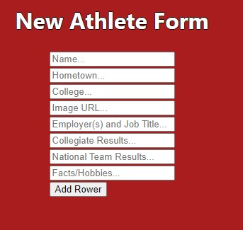

# California Rowing Club

*This is website for the California Rowing Club , a high performance rowing center located in Oakland California. The California Rowing Club exists to provide athletes with an opportunity to develope and train for the Senior Nation Team. Athelete's who make the team will go on to compete at the the World Championships and the Olympics.*

## About

This single page web application has three routes, a home page, an athlete bio page, and a new athlete form page. The home page give some general information about the rowing club including details about the coaching staff, the athlete bios page lists each Athlete and information about them, and the new athlete form page has a form where the user can submit information about a new athlete that will be added to the athlete bios page. 

## Functionality

Each link in the Nativation bar can be selected and will update the URL, subsequently rendering a different component on the page. The selected route in the navigation bar will be highlighted green. In the below image the Athlete Bios page is currently selected.

When the user views the Athlete form page, a new athlete form will be rendered (see below). Once the user fills out the form and clicks the submit button a new athlete bio will be created and appear on the athlete bios page. This information will be saved to the json-server and persist when the page is refreshed.

## Resources

This project was bootstrapped with [Create React App](https://github.com/facebook/create-react-app).

